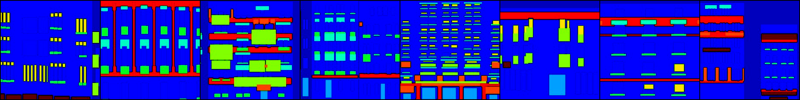
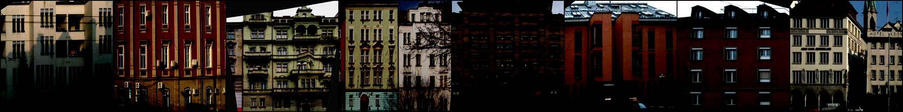
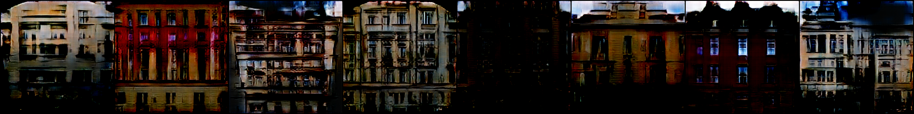
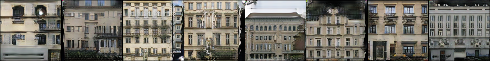
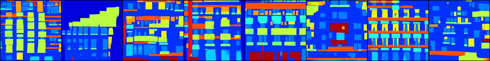
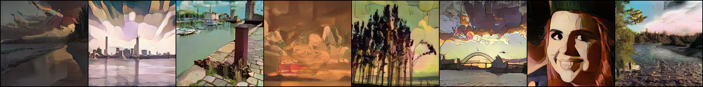
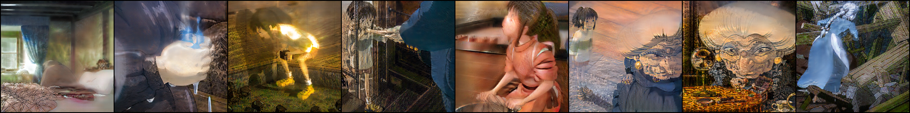

# style-transfer-with-pytorch
Implementations of some style transfer techniques.

## pix2pix
Simple code for [pix2pix](https://arxiv.org/abs/1611.07004) (see this [page](https://github.com/junyanz/pytorch-CycleGAN-and-pix2pix) for the pytorch implementation provided by the authors).
Download data from this [page](http://efrosgans.eecs.berkeley.edu/pix2pix/datasets/) and unzip it to a folder containing both the folders 'datasets' and the folder 'pix2pix'.
To train and sample images during the training, run `python train.py --epochs=200`.
Note that we sample every 10 epochs and at the end of the training.
To save the model, pass on the option `--save-model`.

Below, we show results obtained after training on the facades dataset.
From top to bottom, we show the annotaed image, target image, generated image.

    
    
  

## cycleGAN
Implementation of cycleGAN (see this [page](https://github.com/junyanz/pytorch-CycleGAN-and-pix2pix) for the pytorch implementation provided by the authors).

For facades, download daa from this [page](http://efrosgans.eecs.berkeley.edu/cyclegan/datasets/) (see cycleGAN_dataset for note on how the data should be organized).
For the loss function, we use the GAN loss and the cycle loss as defined in the cycleGAN paper.
We set the number of resnet layers to be 9.
Below, we show some generated data:

    
    

We also tried translation between photos and animation.
For photos, we combined the flickr dataset provided by the authors of cycleGAN with some of the FFHQ dataset.
For animation dataset, we sampled from some animated movies from Studio Ghibli (Spirited Away, Castle in the Sky, Howl's Moving Castle).

    
    

For training, we included the identity loss described in the cycleGAN paper 
(run `cycleGAN_train.py` with the optional argument `--pix-loss`). 
Without this loss, we found that the generator can invert light and dark, most likely because pixel distribution is easy to learn.
We implement this loss using the class down_sampler in cycleGAN_model.py.
To allow more degree of freedom for the generator, one can turn on the blur&pool option.
