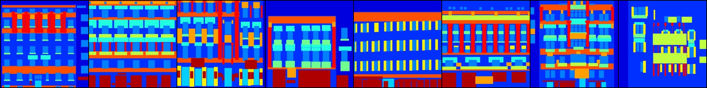
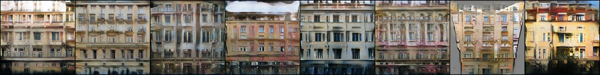

# style-transfer-with-pytorch
Implementations of some style transfer techniques.

## pix2pix
Simple code for [pix2pix](https://arxiv.org/abs/1611.07004) without any bells and whistles (see this [page](https://github.com/junyanz/pytorch-CycleGAN-and-pix2pix) for the pytorch implementation provided by the authors).
Download data from this [page](http://efrosgans.eecs.berkeley.edu/pix2pix/datasets/) and unzip it to a folder containing both the folders 'datasets' and the folder 'pix2pix'.
To train and sample images during the training, run `python train.py --epochs=200`.
Note that we sample every 10 epochs and at the end of the training.
To save the model, pass on the option `--save-model`.

Below, we show results obtained after training on the facades dataset.
From top to bottom, we show the annotaed image, target image, generated image.

    
    
  

