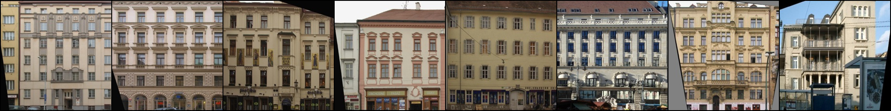
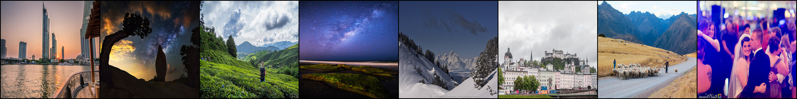

# style-transfer-with-pytorch
Implementations of some style transfer techniques.

## pix2pix
Simple code for [pix2pix](https://arxiv.org/abs/1611.07004) (see this [page](https://github.com/junyanz/pytorch-CycleGAN-and-pix2pix) for the pytorch implementation provided by the authors).
Download data from this [page](http://efrosgans.eecs.berkeley.edu/pix2pix/datasets/) and unzip it to a folder containing both the folders 'datasets' and the folder 'pix2pix'.
To train and sample images during the training, run `python train.py --epochs=200`.
Note that we sample every 10 epochs and at the end of the training.
To save the model, pass on the option `--save-model`.

Below, we show results obtained after training on the facades dataset.
From top to bottom, we show the annotaed image, target image, generated image.

    
    
  

## cycleGAN
Implementation of cycleGAN (see this [page](https://github.com/junyanz/pytorch-CycleGAN-and-pix2pix) for the pytorch implementation provided by the authors).

For facades, download daa from this [page](http://efrosgans.eecs.berkeley.edu/cyclegan/datasets/) (see cycleGAN_dataset for note on how the data should be organized).
For the loss function, we use the GAN loss and the cycle loss as defined in the cycleGAN paper.
We set the number of resnet layers to be 9.
Below, we show some generated data:

    
   

We also tried translation between photos and animation.
For photos, we combined the flickr dataset provided by the authors of cycleGAN with some of the FFHQ dataset.
For animation dataset, we sampled from some animated movies from Studio Ghibli (Spirited Away, Castle in the Sky, Howl's Moving Castle).

    
   

For training, we included the identity loss described in the cycleGAN paper 
(run `cycleGAN_train.py` with the optional argument `--pix-loss`). 
Without this loss, we found that the generator can invert light and dark, most likely because pixel distribution is easy to learn.
We implement this loss using the class down_sampler in cycleGAN_model.py.
To allow more degree of freedom for the generator, one can turn on the blur&pool option.
Below, we show the result of using blur&pool option (we weighed the pix_loss by a factor of 10 instead of 5 for this result)

   

As can be seen, this worsens image quality. 
The most prominent feature is that the barcode-like artifacts become worse (note that such artifacts are present with the original setting of cycleGAN as well).
Such oscillatory behavior is reminicent of the [oscillatory behavior](https://arxiv.org/abs/1904.11486) of CNN classifiers that does not use anti-ailiasing in downsampling and upsampling layers.
The identity loss (i.e. no downsampling) tries to preserve pixel at each position in space, so that oscillatory behavior is penalized.
However, downsampling allows more freedom, and it could allowing the oscillatory behavior to become materialize more prominently.

## CUT
Implementation of the full version of contrastive unpaired translation ([CUT](https://arxiv.org/abs/2007.15651)).
This implementation is a first draft of CUT that do not use anti-aliasing. 
This is done to get a fair comparison with the original cycleGAN (although authors do not mention it in the manuscript, their [github implementation](https://github.com/taesungp/contrastive-unpaired-translation) contains anti-aliasing feature).
We find some interesting differences when compared to cycleGAN, which we highlight below.

First, let us present the result obtained for the facades dataset using the default setting as described by the authors (`python CUT_train.py --epochs=400 --buffer-size=0` )

  

During the training, we noticed that the quality of image generated durng training fluctuates more than cycleGAN.
To reduce the fluctuation, we tried to use image buffer as in cycleGAN (`--buffer-size=50').
However, we found that this did not stabilize the training and instead lead to poorer image quality, as shown below:

  

The choice of patch size of 256 (the number of features extracted using MLP) is also important in the image quality.
We found that using `--num-patches=64' reduces the image quality:
 

  

We also tried changing some of the settings.
For example, in the computation of NCE loss, the goal is to minimize the mutual information between 1) the features extracted from the original image and 2) the generated image.
The authors let the gradient flow to the generator only from 2), so we also experimented by allowing the gradient flow to the encoder part of the generator from 1).
We find that this leads to a poorer performance.

  

Next, let us present the result obtained for ani2photo dataset that was used for cycleGAN above using the default CUT settings (except the anti-aliasing).
The upper row is the original photo and the lower row is the generated photo in the stye of animated movies.

    
  

Also, we find that the quality of the generated image did not fluctuate as it did for the facades dataset.
We hypothesize that the number of images in the dataset may be important for this aspect of CUT (order of 100 vs 1000 for facades vs ani2photo).
However, we find that CUT does not make much changes to the photo, and seems to prefer to just change the shades of the photos.
See, for example, the rightmost photo in the results shown below:

    
  

Because default option for CUT compares the pixels between the original and generated images, it does not seem to invert the pixel brightness like cycleGAN without the identity loss.
Below, we show results of cycleGAN trained without the identity loss on a small ani2photo dataset (obtained while I was doing some experiments):

    
  
</p

## Things to try
* Test the effects of anti-aliasing. As we have observed previously, the results of cycleGAN has some spatial oscillation. This is also present in the results generated from CUT, although it is not as bad (perhaps because we randomly extract features with MLP?)
* Get CUT to make more changes to the photo.
* This [paper](https://arxiv.org/abs/2110.11271) may be worth checking out
* The idea of contrasting patches of generated images with relevant part of real images can be viewed as a sort of attention mechanism. It would be interesting to play around with this idea.
